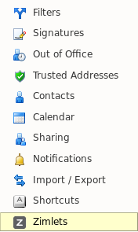
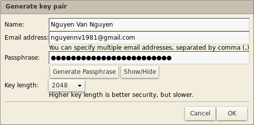
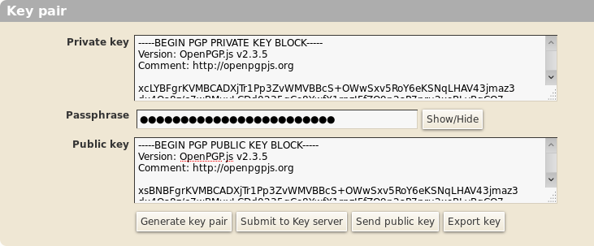
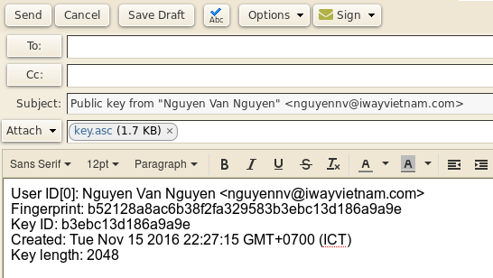

# Hướng dẫn cài đặt và sử dụng OpenPGP Secure Zimlet
## Hướng dẫn kích hoạt và cấu hình OpenPGP Secure Zimlet
### Kích hoạt OpenPGP Secure Zimlet
1. Tại trang chủ chọn mục **Preferences -> Zimlets**
 
1. Chọn "**OpenPGP Secure Email**" để kích hoạt OpenPGP Secure Zimlet
 

### Cấu hình OpenPGP Security
1. **OpenPGP Mail Sercurity**
 1.1. Tại trang chủ chọn mục **Preferences -> OpenPGP Security**
 
 
 1.2. Mục "**OpenPGP Mail Security**" bao gồm các tùy chọn gửi thư:
   
   > **Auto (remember last settings)**: OpenPGP Security sẽ sử dụng tùy chọn gửi thư gần nhất.
   
   > **Do not sign or encrypt**: Không sử dụng tính năng ký số và mã hóa nội dung thư.
   
   > **Sign Only**: Chỉ sử dụng tính năng ký số nội dung thư.
   
   > **Sign and encrypt**: Sử dụng đồng thời tính năng ký số và mã hóa nội dung thư.
   
  
   
2. **Quản lý cặp khóa (Key pair)**
 2.1. Tại trang chủ chọn mục **Preferences -> OpenPGP Security**. Mục **Key pair** sẽ có giao diện như hình mình họa bên dưới. Người dùng điền các thông tin đã có sẵn vào các mục ***Private key***, ***Passphrase*** và ***Public key***.
 
 2.2. Trong trường hợp người dùng chưa có cặp khóa hoặc muốn tạo một cặp khóa mới, chọn **Generate key pair** sẽ xuất hiện một pop-up yêu cầu nhập đầy đủ các thông tin về Họ tên (Name), Địa chỉ hòm thư điện tử (Email), Mật khẩu khóa (Passphrase) và lựa chọn độ dài của khóa (Key length).
 
 2.3. Sau khi điền đầy đủ thông tin yêu cầu, chọn **OK** để tiến hành khởi tạo cặp khóa. Cặp khóa được khởi tạo sẽ được hiển thị như trong hình.
 
 2.4. Người dùng có thể gửi khóa công khai (Public key) đến máy chủ (thao tác này sẽ giúp người dùng khác có thể tìm kiếm được khóa công khai của bạn) bằng cách bấm vào tùy chọn **Submit to key server**.
 2.5. Trong trường hợp cần gửi khóa công khai của mình đến người khác, người dùng có thể chọn **Send public key**. Một cửa sổ soạn thạo thư mới sẽ xuất hiện cho phép bạn gửi khóa công khai của bạn cho người nhận.
 
 2.6. Chọn **Export key** để lưu offline khóa bí mật (Private key) của người dùng về thiết bị.

3. **Manage public keys**
 3.1. Tại trang chủ chọn mục **Preferences -> OpenPGP Security**. Mục **Manage public keys** sẽ có giao diện như hình mình họa bên dưới.
 
 3.2. Tùy chọn **Key server lookup** sẽ hỗ trợ người dùng tìm kiếm và thêm khóa công khai của người dùng khác từ máy chủ.
 
 3.2. Tùy chọn **Add public key** sẽ hỗ trợ người dùng thêm trực tiếp khóa công khai của người dùng bằng cách Paste nội dung khóa công khai của người dùng cần thêm, sau đó chọn **OK** để hoàn tất việc thêm khóa công khai mới vào danh sách.
 
 3.3. Tùy chọn **Export all keys** sẽ hỗ trợ lưu offline toàn bộ danh sách khóa công khai về thiết bị của người dùng.
 3.4. Người dùng có thể xóa khóa công khai trong danh sách bằng cách click chuột phải vào khóa công khai cần xóa và chọn **Delete**.
 

### Soạn thảo thư sử dụng OpenPGP Secure Zimlet
1. Tại mục **Mail** chọn **New Message**. Một cửa sổ soạn thảo thư mới sẽ xuất hiện
1. Trên thanh tác vụ của cửa sổ soạn thảo thư, người dùng có thể lựa chọn:
   > **Don't sign**: Không sử dụng tính năng ký số và mã hóa nội dung thư.
   
   > **Sign**: Chỉ sử dụng tính năng ký số nội dung thư.
   
   > **Sign and encrypt**: Sử dụng đồng thời tính năng ký số và mã hóa nội dung thư.

 
1. Sau khi chọn tùy chọn phù hợp, bấm **Send** để gửi thư.
 
1. Trong trường hợp người dùng chưa có khóa bí mật, một popup cảnh báo sẽ xuất hiện với nội dung như hình bên dưới.
 
1. Trong trường hợp người dùng chưa có khóa công khai của người nhận, một popup cảnh báo sẽ xuất hiện với nội dung như hình bên dưới. 
 

### Đọc thư có nội dung được ký số/mã hóa
* Thư có nội dung ký số/mã hóa sẽ được mã hóa và có chú thích như hình minh họa bên dưới.
 
 
