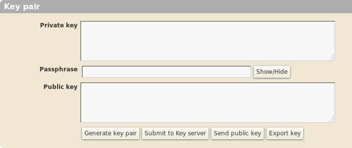
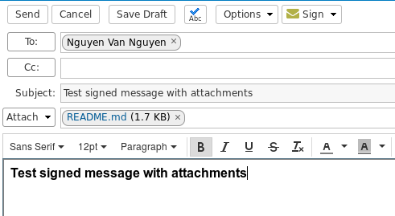
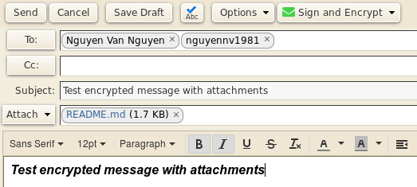

# Hướng dẫn cài đặt và sử dụng OpenPGP Secure Zimlet
## Hướng dẫn cài đặt
### Kích hoạt OpenPGP Secure Zimlet
1. Tại trang chủ chọn mục **Preferences -> Zimlets**

1. Chọn "**OpenPGP Secure Email**" để kích hoạt OpenPGP Secure Zimlet

### Cấu hình OpenPGP Security
1. OpenPGP Mail Sercurity
 1. Tại trang chủ chọn mục **Preferences -> OpenPGP Security**

 1. Mục "**OpenPGP Mail Security**" bao gồm các tùy chọn gửi thư:

> **Auto (remember last settings)**: OpenPGP Security sẽ sử dụng tùy chọn gửi thư gần nhất.

> **Do not sign or encrypt**: Không sử dụng tính năng ký số và mã hóa nội dung thư.

> **Sign Only**: Chỉ sử dụng tính năng ký số nội dung thư.

> **Sign and encrypt**: Sử dụng đồng thời tính năng ký số và mã hóa nội dung thư.

### Quản lý cặp khóa
1. Tại trang chủ chọn mục **Preferences -> OpenPGP Security**.
1. Navigate to "OpenPGP Security" you will see "Key pair" Section

1. You can enter you existed key pair or
1. Click "Generate key pair" button, a "Generate key pair" will appear.

1. After click "Ok" button. Your key pair is generated and "Key pair" Section will look like this

1. You can submit your public key to pgp key server by clicking "Submit to Key server" button.
1. You can send your public key to someone by clicking "Send public key" button. A new compose window will open for sending your public key.

1. You can save your private key to a file by clicking "Export key" button.

### Manage public keys
1. Open your Preferences in Zimbra.
1. Navigate to "OpenPGP Security" you will see "Public keys" Section

1. You can lookup someone's public key on key server by clicking "Key server lookup" button.

1. You can add armored public keys by clicking "Add public key" button.

1. You can download all public keys and save to file by clicking "Export all keys" button.
1. Your can delete a public key by right click a public on list and choose "Delete"

### Composing
1. In "Mail" tab click "New Message". A "Compose" tab will appears.
1. On toolbar of "Compose" tab. You can choose "Don't Sign", "Sign", "Sign and Encrypt" your message

1. You can sign your message on "Compose" tab like this

1. If you don't have your private key, a waring dialog will appears

1. You can sign and encrypt your message on "Compose" tab like this

1. If one or more receivers don't have public key, a waring dialog will appears

### Reading signed/encrypted messages
1. Reading signed message

1. Reading encrypted message

